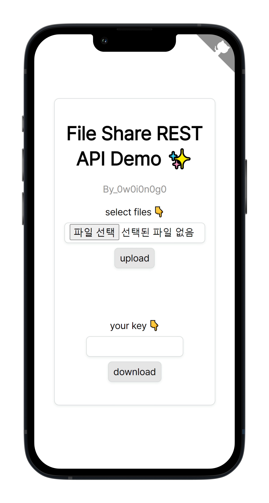

<div align="center">

# File Share REST API

<p align="center">
  
</p>

By_0w0i0n0g0

<br>
<br>

## Table of Contents

[Description](#description)

[Usage](#usage)

[Example](#example)

[Policy and Warning](#policy-and-warning)

</div>

<br>
<br>

## Description

This is Completely **FREE** File Share RESTful API, which provides a function to download a file through a key issued after uploading one or several files.

<br>
<br>

## Usage

<br>

### Upload file

- REQUEST

```
[POST] https://file-share-rest-api.herokuapp.com/files
```

```
[header]
Content-Type: multipart/form-data

[form]
action="https://file-share-rest-api.herokuapp.com/files"
method="post"
enctype="multipart/form-data"

[input]
type="file"
name="files"
```

- RESPONSE

```
[code]

200 - OK
File uploaded successfully.

429 - Too Many Requests
Requests are limited to one request per second.

503 - Service Unavailable
You may have exceeded the maximum upload size.
```

```json
[body]

{
  "key": "1234",
  "files": ["file-name-1.format", "file-name-2.format", ...]
}
```

<br>

### Download file

- REQUEST

```
[GET] https://file-share-rest-api.herokuapp.com/files/{key}
```

- RESPONSE

```
[code]

200 - OK
File downloaded successfully.

429 - Too Many Requests
Requests are limited to one request per second.
```

<br>
<br>

## Example

<br>

### Demo

<a href="">
  <p align="center">
    
  </p>
</a>

- [Click here to Try it!]()

<br>

### Upload file

- Vanilla JS

```html
<form
  id="file_upload_form"
  action="https://file-share-rest-api.herokuapp.com/files"
  method="post"
  enctype="multipart/form-data"
>
  selected files : <input id="file_input" type="file" name="files" multiple />
  <button type="submit">upload</button>
</form>

<script>
  let xhr = new XMLHttpRequest();
  let form = document.getElementById("file_upload_form");
  form.onsubmit = function (event) {
    event.preventDefault();
    let formData = new FormData(form);
    formData.append("file_input", file_input);
    xhr.onreadystatechange = function () {
      if (xhr.readyState == XMLHttpRequest.DONE) {
        //Here is your response body.
        console.log(JSON.parse(xhr.responseText));
      }
    };
    xhr.open("POST", form.getAttribute("action"), true);
    xhr.send(formData);
  };
</script>
```

- jQuery

```html
<form id="file_upload_form">
  selected files : <input id="file_input" type="file" name="files" multiple />
  <button type="submit">upload</button>
</form>

<script src="https://cdn.jsdelivr.net/npm/jquery@3.6.0/dist/jquery.min.js"></script>
<script>
  $("#file_upload_form").submit(function (event) {
    event.preventDefault();
    let form = $("#file_upload_form")[0];
    let data = new FormData(form);
    $.ajax({
      type: "POST",
      enctype: "multipart/form-data",
      url: "https://file-share-rest-api.herokuapp.com/files",
      data: data,
      processData: false,
      contentType: false,
      cache: false,
      timeout: 600000,
      success: function (data) {
        //Here is your response body.
        console.log(data);
      },
    });
  });
</script>
```

<br>

### Downlaod file

- Vanilla JS

```html
<form id="file_download_form">
  key : <input type="number" id="key" min="0" max="9999" required />
  <button type="submit">download</button>
</form>

<script>
  let xhr = new XMLHttpRequest();
  let form = document.getElementById("file_download_form");
  form.onsubmit = function (event) {
    event.preventDefault();
    let key = document.getElementById("key").value;
    window.location.href =
      "https://file-share-rest-api.herokuapp.com/files/" + key.toString();
  };
</script>
```

- jQuery

```html
<form id="file_download_form">
  key : <input type="number" id="key" min="0" max="9999" required />
  <button type="submit">download</button>
</form>

<script src="https://cdn.jsdelivr.net/npm/jquery@3.6.0/dist/jquery.min.js"></script>
<script>
  $("#file_download_form").submit(function (event) {
    event.preventDefault();
    event.preventDefault();
    window.location.href =
      "https://file-share-rest-api.herokuapp.com/files/" + $("#key").val();
  });
</script>
```

<br>
<br>

## Policy and Warning

- Requests are limited to one request per second through bucket4j. If you try too much, you can get a 429 code.

- The maximum file size that can be uploaded is 100MB, and maximum request size is also 100MB.

- If you upload multiple files, they are compressed into a zip file. In addition, the file name can change to key number depending on the internal logic.

- After approximately 5 minutes, the uploaded files will be deleted. This can be changed depending on heroku server.

- If someone steals a key, he can also access to the uploaded file. Be careful not to expose your key, and do not upload important files containing personal information or secrets.

- Sometimes there may be a delay when you first call the API because it is running on free Heroku server.
